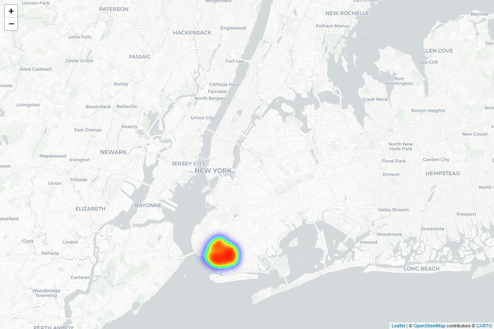
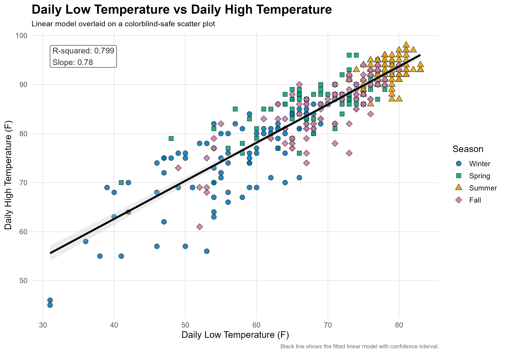
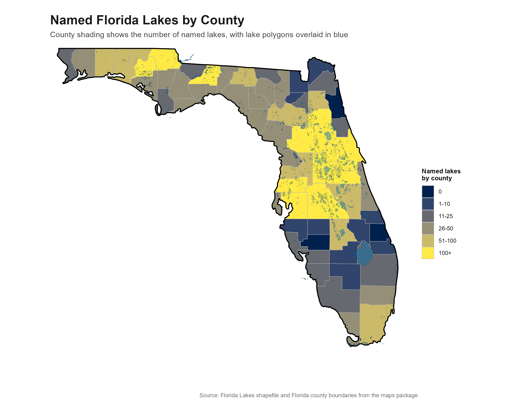

# Data Visualization and Reproducible Research

> Henry Marsh. 

This repository contains three projects completed during Data Visualization and Reproducible Research. Together, they demonstrate exploratory analysis, interactive visualization, spatial data, model visualization, accessibility, and reproducible research.

## Project 01: NYC Rat Complaints

This project explores NYC rat complaints through geographic, temporal, and complaint-level patterns. The interactive maps allow the reader to examine individual complaint locations and larger areas of complaint density.

This is a snapshot of this projects interactive and improved map, while keeping the same color aesthetic due to others not having a high enough contrast. 
Click the link below it for the interactive version.

[Open the interactive NYC rat complaint map](figures/nyc_rats_interactive.html)

## Project 02: Weather and Florida Lakes

This project examines seasonal weather patterns in Atlanta and the spatial distribution of lakes across Florida. It combines interactive time-series data, calendar heatmaps, model visualization, and spatial analysis.

This is this Projects Model graph, and was improved by using shapes and varried colors, rather than a simple blue gradient filter to improve user expierence.

[Open the Weather Model Figure](figures/project_02_weather_model.png)

While this is instead the spatial plot using Florida Lakes data for this portion of the project. What has changed ,as you can see by going to the Project 3 Mini project 2 file in Project 2, was the contrast colors, the lake variable used, as well going by countries now.

[Lakes Across Florida by county](figures/project_02_florida_lakes_map.png)

## Project 03: Tampa Weather and Concrete Strength

This project examines monthly temperature and precipitation patterns in Tampa during 2022, followed by an exploration of the variables connected to concrete strength.

This Plot is a snapshot of the interactive map for this project, while you can see the full interactive html on the link below it.

## Moving Forward

This course helped me better understand how visualization can make complex data easier to read without removing the detail behind it. Moving forward, I want to continue using interactive and spatial visualizations to make data exploration more useful and engaging.
